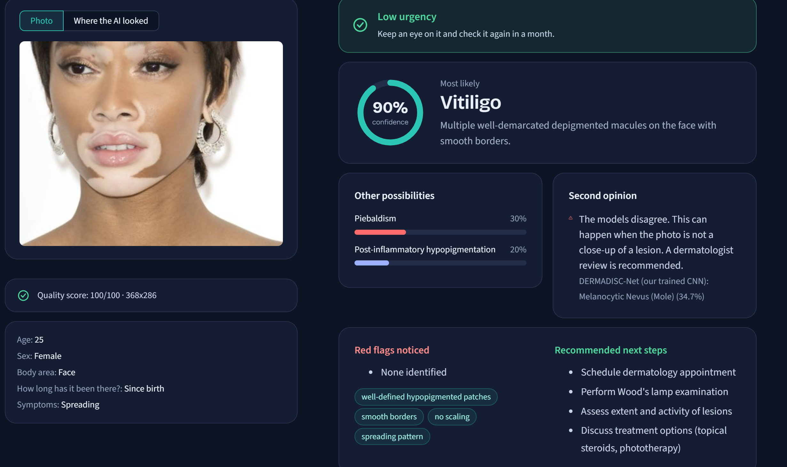
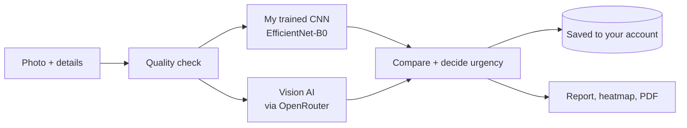
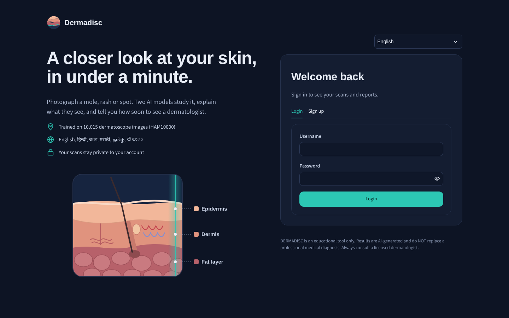
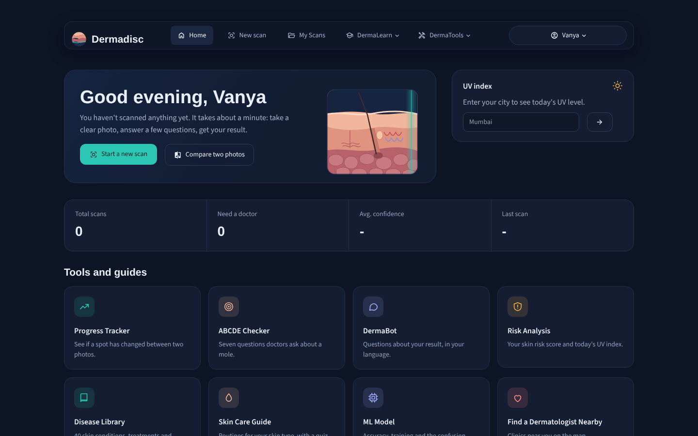

<h1 align="center">Dermadisc</h1>

<p align="center">
  <b>Take a photo of a skin spot. Get a second opinion in under a minute.</b>
</p>

<p align="center">
  
  
  
  
  
</p>

<p align="center">
  
</p>

## Why I built this

Lots of people notice a mole, a rash or a patch of skin changing colour and just... wait. Seeing a dermatologist isn't always quick or easy, especially outside big cities, and Googling symptoms usually makes things scarier, not clearer.

I wanted to build something that sits in between: you take a photo, answer a few questions, and get a calm, clear answer on what it *might* be and how soon you should actually see a doctor, in your own language.

> [!IMPORTANT]
> Dermadisc is a student project and a screening tool, **not** a doctor. It can be wrong. If something on your skin worries you, please get it checked in person.

## What it does

You upload a photo (or use your camera), fill in a few details like age, body area and how long it's been there, and two different AIs look at it:

- **My own trained model.** I fine-tuned an EfficientNet-B0 on the HAM10000 dataset (10,015 dermatoscope images of 7 kinds of skin lesions). It runs completely offline on a normal laptop.
- **A vision language model.** Through OpenRouter, a large AI model looks at the same photo. It knows a lot more conditions (around 40), like vitiligo, eczema and acne.

Then the app compares the two. If they agree, great. If they don't, it tells you so, instead of pretending to be sure. In the screenshot above, my model only knows moles and lesions, so it disagreed, and the app says so and recommends a dermatologist.

### Things I'm proud of

- 🔥 **It shows where it looked.** The "Where the AI looked" tab draws a heatmap. It hides parts of the photo one at a time and watches how the prediction changes.
- 🤔 **It admits when it's not sure.** If my model's confidence is low, it says "Not sure" instead of making up an answer.
- 🌐 **It speaks 6 languages.** English, हिन्दी, বাংলা, मराठी, தமிழ் and తెలుగు, including the AI's answers and the PDF reports. Getting Indian scripts to render properly in PDFs was way harder than I expected.
- 📄 **You can download a PDF report** of any scan to show a doctor.
- 👤 **Everyone gets their own account** and scan history, and there's an admin panel to see everything.
- 🛠️ **A few extra tools:** compare two photos of the same spot over time, an ABCDE mole checklist, a skin-cancer risk score with today's UV index, a chatbot, a library of 40 skin conditions and a skin-care guide for different skin types.

## How it works under the hood



A few details if you're curious:

- The CNN was trained in Google Colab with transfer learning from ImageNet. HAM10000 is very unbalanced (most images are ordinary moles), so I used class-weighted loss, label smoothing and lots of augmentation.
- At prediction time the model looks at the photo 4 times (normal, flipped twice, rotated) and averages its answers, which makes it noticeably steadier.
- I exported it to ONNX, so you don't need PyTorch to run the app.
- If one free AI model is busy or gone, the app automatically tries the next one.
- Passwords are salted and hashed (PBKDF2-SHA256), never stored as plain text.

## Screenshots

| Sign in | Dashboard |
| --- | --- |
|  |  |

## Built with

Python · Streamlit · PyTorch · EfficientNet-B0 · ONNX Runtime · NumPy · Pillow · OpenRouter API · SQLite · pandas · Altair · fpdf2 · HarfBuzz · Open-Meteo

## Try it yourself

1. Download this repo (**Code → Download ZIP**) and unzip it.
2. Open a terminal in the folder and run:

```bash
python -m pip install -r requirements.txt
python -m streamlit run app.py
```

3. It opens in your browser at http://localhost:8501. Sign in with `admin` / `admin123` (and please change that password in **My Account**), or just create your own account.
4. For the vision AI, grab a free key from [openrouter.ai/keys](https://openrouter.ai/keys) and paste it in **My Account**. Without a key, my trained model still works offline.

## What's in the folder

```
├── app.py                     # the app: every page and screen
├── dd_core.py                 # the AI part: my model, the heatmap, OpenRouter calls
├── dd_db.py                   # accounts and saved scans (SQLite)
├── dd_i18n.py                 # the 6 languages
├── dd_pdf.py                  # PDF reports
├── dd_ui.py                   # the look: dark theme, logo, icons
├── dermadisc_model.onnx       # my trained model
├── dermadisc_model_meta.json  # its classes and settings
├── train_dermadisc.ipynb      # the Colab notebook I trained it with
└── fonts/                     # fonts for the PDFs
```

## Honest limitations

- My model only knows the 7 lesion types in HAM10000, and that dataset is mostly lighter skin, so it's less reliable on darker skin tones. For everything else, the vision AI does the heavy lifting.
- Vision AIs can sound confident and still be wrong. Free models also have daily limits.
- The risk score is for awareness, not a clinically tested formula.

## What I'd like to add next

- Train on a bigger dataset with more conditions and more skin tones.
- Put it online so anyone can use it without installing anything.
- Let a real dermatologist review flagged scans.

---

<p align="center">If you found this interesting, a ⭐ would make my day!</p>
